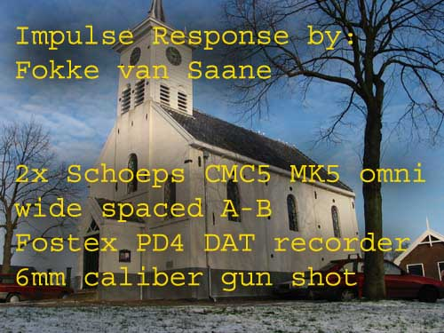
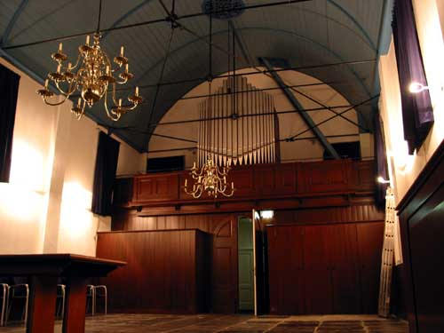

# Simulador de Acústica com Convolução (PDS)

## Sobre o Projeto
Este projeto foi desenvolvido como uma atividade prática da disciplina de Processamento Digital de Sinais (PDS). O objetivo principal é aplicar os conceitos teóricos de Sinais e Sistemas para criar um efeito de reverberação realista usando uma operação matemática fundamental: a **convolução**.

## O que eu tinha no início
Comecei o projeto com apenas dois recursos base:
1. **Meu áudio de entrada:** Uma gravação simples da minha voz, seca e sem efeitos (`entrada.wav`).
2. **A Resposta ao Impulso:** Um arquivo de áudio capturado dentro de uma igreja (`resposta-impulso.wav`). 

### Detalhes da Captura da Resposta ao Impulso
A resposta ao impulso que utilizei foi gravada na Igreja de Schellingwoude. A captura não é feita por mágica, mas sim por equipamentos reais e um estímulo sonoro de alta energia.

De acordo com as informações do arquivo:
* **Engenheiro de Som:** Fokke van Saane
* **Microfones:** 2x Schoeps CMC5 MK5 omni (técnica de microfonação A-B espaçada)
* **Gravador:** Fostex PD4 DAT recorder
* **O "Impulso" físico:** Um tiro de festim de pistola calibre 6mm (6mm caliber gun shot). O estampido rápido do tiro é o que excitou a acústica da igreja para gerar o eco gravado.

## Meu entendimento sobre Resposta ao Impulso
Gosto de teorizar como a resposta ao impulso funciona na prática. Trato o ambiente (neste caso, a igreja) como uma **caixa preta**. Eu não preciso saber qual é a função matemática exata ou a equação diferencial que descreve a acústica de cada parede daquele lugar. 

Basta emitir um sinal muito rápido e de altíssima amplitude lá dentro (como o tiro de 6mm listado acima) e gravar o eco gerado. Esse eco é a nossa "Resposta ao Impulso". A mágica acontece na matemática: ao pegar o meu áudio de voz e aplicar a **convolução** dele com essa resposta ao impulso, a saída vai me dar exatamente o resultado da minha voz passando por aquela função "caixa preta" do mundo real.

## Dicas do Professor em aula: Mono e Normalização
Antes de começar a desenvolver o projeto no Octave, duas orientações foram cruciais para o algoritmo funcionar sem erros:
* **Trabalhar com Áudio Mono:** Arquivos estéreo viram matrizes de duas colunas. Para a matemática da convolução funcionar de forma direta, precisamos extrair apenas uma faixa (uma coluna), transformando os sinais em vetores unidimensionais (1D).
* **A Necessidade da Normalização:** A operação de convolução soma e multiplica milhares de amostras sucessivamente, o que gera valores que estouram facilmente o limite digital do áudio (que deve ficar entre `-1.0` e `1.0`). Se salvarmos o áudio resultante sem tratar isso, ocorre o temido **clipping** (ceifamento), que destrói o som com distorção. A solução foi criar uma etapa para encontrar o pico máximo absoluto do vetor resultante e dividir todo o áudio por esse valor, garantindo que o teto fique perfeitamente cravado em `1.0`.

## Divisão do Código em Etapas
Para organizar o raciocínio, dividi o script do Octave em 5 fases lógicas:

* **Fase 1: Importação:** Uso da função `audioread` para puxar os arquivos `.wav` originais para dentro do ambiente de trabalho, armazenando as matrizes de áudio e a frequência de amostragem (`fs`).
* **Fase 2: Conversão para Mono:** Aplicação de *slicing* nas matrizes (ex: `entrada(:, 1)`), isolando a primeira coluna para garantir o formato de vetor 1D.
* **Fase 3: A Convolução (O processamento principal):** Uso da função nativa `conv()` operando sobre o áudio de entrada e a resposta ao impulso. É aqui que o ambiente virtual é aplicado na voz.
* **Fase 4: Normalização:** Uso das funções combinadas `max(abs())` para encontrar o maior pico da convolução e dividir o vetor inteiro por ele, evitando a distorção.
* **Fase 5: Exportação:** Uso da função `audiowrite` para transformar o vetor final e normalizado de volta em um arquivo de mídia real (`.wav`), pronto para ser reproduzido.

## Resultado Final
O resultado prático de toda essa matemática é fascinante: ao realizar a convolução do meu áudio original (a voz "seca" de entrada) com a resposta ao impulso capturada na igreja, o algoritmo gerou um novo arquivo sonoro. 

Ao escutar esse arquivo de saída, a sensação acústica é exata: soa perfeitamente como se eu estivesse fisicamente dentro daquela igreja no momento da gravação. Isso prova que a "assinatura espacial" e o eco daquele ambiente foram transferidos com sucesso para a minha voz, unindo a teoria abstrata com o mundo real.

